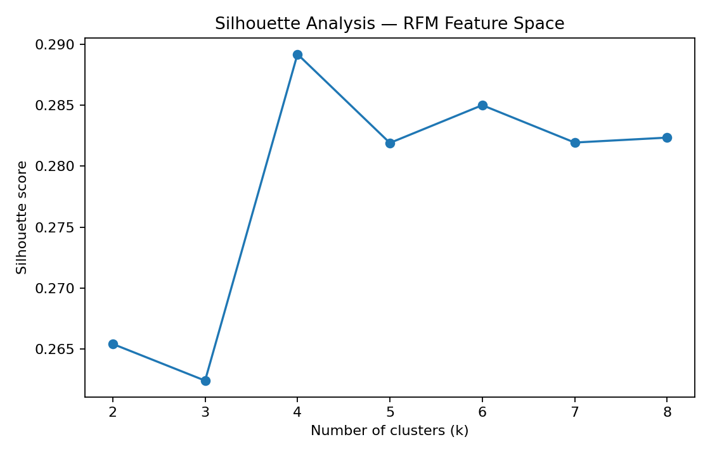
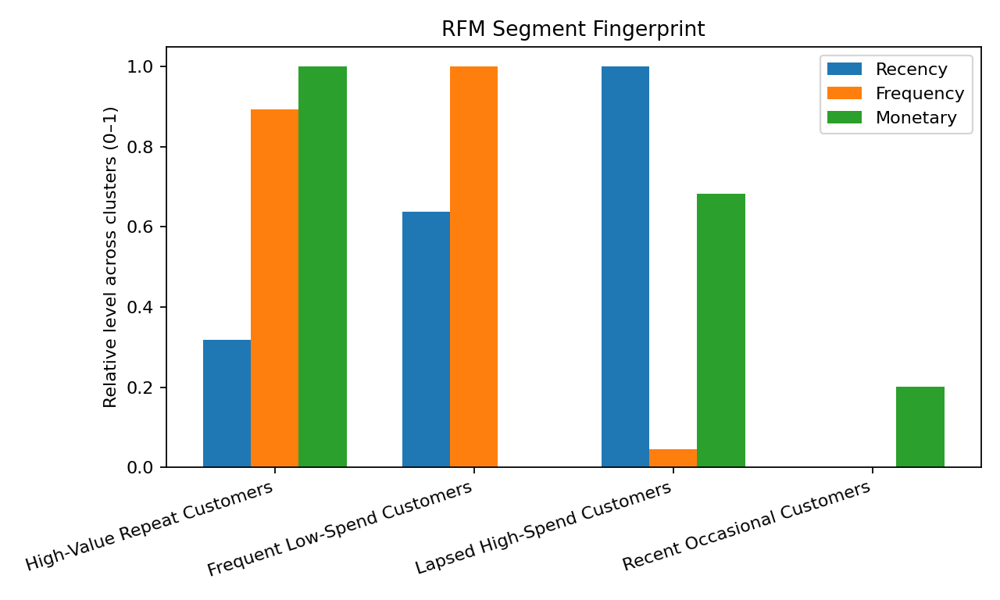

# E-commerce Customer Segmentation with RFM

A portfolio-ready customer-segmentation project using **RFM (Recency, Frequency, Monetary) analysis** and **K-Means clustering** to identify actionable e-commerce customer groups.

The original academic workflow explored several alternatives — broader K-Means feature sets, sensitivity analysis, Isolation Forest, K-Prototypes, and GMM + PCA — before converging on a simpler and more interpretable **RFM-only K-Means model with K=4**.

## Business question

How can an e-commerce business group customers by purchasing value and engagement pattern so that retention, re-engagement, cross-sell and upsell actions can be targeted more effectively?

## Why RFM was selected

The exploratory models showed that broader feature sets could be driven by operational variables such as discount usage and loyalty-program membership. The final design therefore focuses the clustering itself on three direct behavioral/value signals:

- **Recency** — days since the customer's recorded purchase
- **Frequency** — purchase frequency
- **Monetary** — purchase amount

Demographic, operational and label-like fields are used only for post-cluster profiling or validation.

## Dataset

The repository uses the public **Ecommerce Consumer Behavior Analysis Data** dataset from Kaggle:

- 1,000 customers
- 28 fields
- purchase behavior, demographics, engagement, loyalty, satisfaction and purchase-intent variables
- license: **CC BY 4.0**

See [`DATASET.md`](DATASET.md) for source attribution and usage notes.

## Final model

**K-Means on min-max-scaled RFM features, K=4**

| Metric | Result |
|---|---:|
| Silhouette score | **0.289** |
| Davies-Bouldin Index | **1.128** |
| Mean pairwise ARI across seeds | **0.980** |
| Customers | **1,000** |

The silhouette curve peaks at **K=4** in the evaluated 2–8 range. The high ARI indicates that the final RFM segmentation is stable across the tested random seeds.



## Customer segments

| Segment | Customers | Avg. recency (days) | Avg. frequency | Avg. monetary | Business interpretation |
|---|---:|---:|---:|---:|---|
| **High-Value Repeat Customers** | 261 | 156.3 | 9.1 | $406.58 | Retention, loyalty recognition, cross-sell and selective upsell. |
| **Frequent Low-Spend Customers** | 264 | 213.5 | 9.7 | $160.71 | Increase average order value with bundles, cross-sell and threshold-based offers. |
| **Lapsed High-Spend Customers** | 226 | 278.3 | 4.4 | $328.50 | Prioritize win-back and re-engagement campaigns; investigate reasons for inactivity. |
| **Recent Occasional Customers** | 249 | 99.2 | 4.1 | $209.95 | Nurture repeat purchasing with onboarding-style journeys and second-purchase incentives. |



### 1. High-Value Repeat Customers
High purchase frequency and the highest monetary value, with mid-range recency.  
**Action:** protect retention, recognize loyalty, and prioritize relevant cross-sell/upsell.

### 2. Frequent Low-Spend Customers
The highest purchase frequency but the lowest average monetary value.  
**Action:** focus on increasing basket size through bundles, cross-sell and spend-threshold mechanics.

### 3. Lapsed High-Spend Customers
Relatively high historical monetary value but the oldest average recency and lower frequency.  
**Action:** prioritize win-back and re-engagement; investigate why valuable customers became inactive.

### 4. Recent Occasional Customers
The most recent purchases but relatively low frequency and moderate spend.  
**Action:** nurture a second/next purchase and build repeat behavior.

> These marketing actions are analytical recommendations derived from the RFM profiles; they were not tested as causal interventions.

## Post-hoc checks

`Customer_Satisfaction` and `Purchase_Intent` were intentionally excluded from clustering and examined only afterward. In this dataset, chi-square tests did **not** show a significant association between RFM cluster membership and either variable:

- Purchase Intent p-value: **0.795**
- Customer Satisfaction p-value: **0.914**

This is a useful finding rather than a failure: the final segmentation captures **purchase timing, frequency and economic value**, not every dimension of customer attitude or intent.

## Model-development path

The original project tested several alternatives before selecting the final model:

1. **Broader K-Means feature set** — more behavioral/operational variables, but weaker geometric separation.
2. **Sensitivity analysis** — removing dominant discount and loyalty variables materially changed the cluster structure.
3. **Isolation Forest** — no evidence that a small extreme-outlier population explained the clustering behavior.
4. **K-Prototypes** — tested because the source data mixes numerical and categorical features; stability remained limited in the original experiment.
5. **GMM + PCA** — useful as a soft-clustering comparison, but model-selection criteria favored a more granular structure than was desirable for a practical marketing segmentation.
6. **RFM + K-Means** — selected for interpretability, stability and direct alignment with customer-value segmentation.

The repository keeps the final pipeline concise while preserving selected comparison logic in [`src/model_comparison.py`](src/model_comparison.py).

## Repository structure

```text
ecommerce-customer-segmentation/
├── README.md
├── DATASET.md
├── LICENSE
├── requirements.txt
├── .gitignore
├── data/
│   └── ecommerce_consumer_behavior.csv
├── notebooks/
│   └── ecommerce_customer_segmentation.ipynb
├── src/
│   ├── customer_segmentation.py
│   └── model_comparison.py
├── results/
│   ├── final_model_metrics.csv
│   ├── k_selection_metrics.csv
│   ├── cluster_summary.csv
│   └── post_analysis_means.csv
└── assets/
    ├── kmeans_elbow.png
    ├── kmeans_silhouette.png
    ├── cluster_sizes.png
    ├── rfm_profile.png
    └── rfm_pca.png
```

## Run locally

```bash
python -m venv .venv
# Windows: .venv\Scripts\activate
# macOS/Linux: source .venv/bin/activate

pip install -r requirements.txt
python src/customer_segmentation.py
```

## Key methodological choices

- Removed technical IDs from modeling.
- Converted purchase amount to a numeric feature.
- Used a fixed reference date (`2024-12-31`) to reproduce Recency.
- Used Min-Max scaling so R, F and M contribute on comparable scales.
- Chose `K=4` using Elbow/Silhouette analysis plus business interpretability.
- Tested stability across multiple random seeds using Adjusted Rand Index.
- Kept satisfaction and purchase intent out of clustering to avoid label leakage.
- Used demographics and additional behavioral variables for interpretation, not to define the final RFM clusters.

## Limitations

- The dataset contains only 1,000 records and is a public analytical dataset rather than a live production customer table.
- The fixed Recency reference date is appropriate for reproducing this project, but a production pipeline would use a dynamic observation date.
- RFM is intentionally simple and does not capture product-level, channel-level or attitudinal behavior.
- Cluster labels are descriptive analytical constructs, not ground-truth customer classes.
- Marketing recommendations should be validated through experimentation before operational use.

## Portfolio takeaway

The main value of this project is not simply fitting K-Means. It demonstrates an iterative modeling process: detecting when richer feature sets create less useful segmentation, comparing alternative clustering approaches, narrowing the model to a stable and interpretable behavioral core, and translating the resulting segments into concrete business actions.
